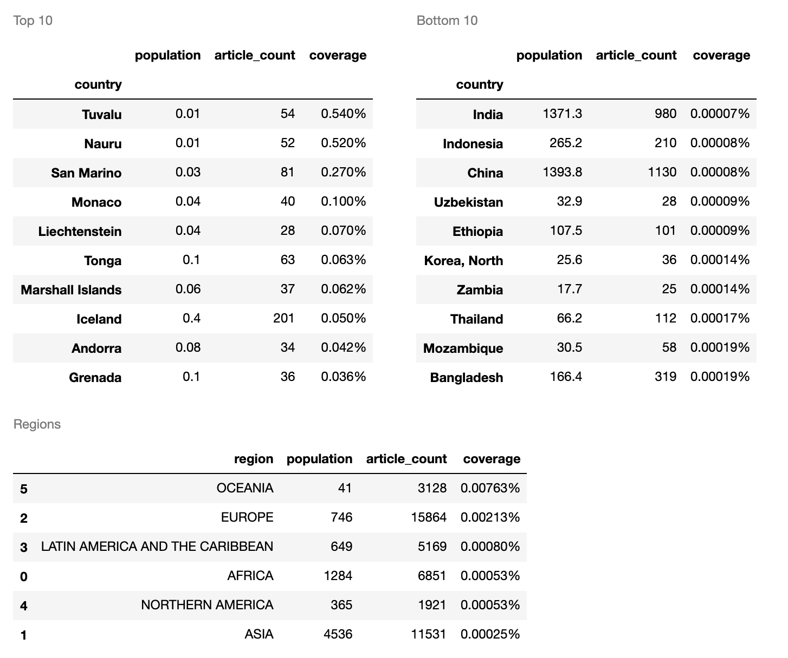
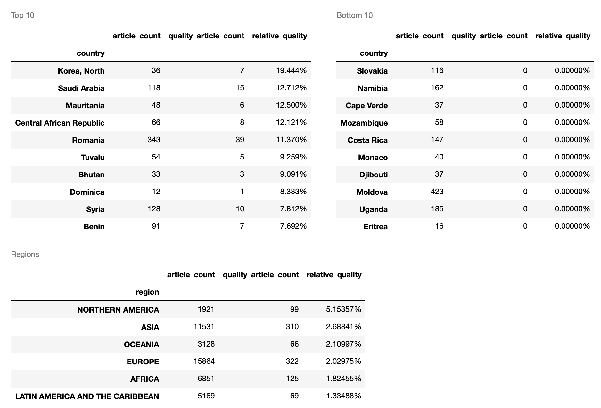

# A2: Bias in Data

Name: Benjamin Brodeur Mathieu

Date: 10/12/2019

## Goal
The goal of this assignment is to reflect on sources of bias by analyzing coverage and relative article quality by country and geographical regions of politicians articles taken from the English Wikipedia.

To do this we will be generating tables showing:

1. the countries with the greatest and least coverage of politicians on Wikipedia compared to their population.
2. the countries with the highest and lowest proportion of high quality articles about politicians.
3. a ranking of geographic regions by articles-per-person and proportion of high quality articles.

## Repository structure
```
├── LICENSE
├── README.md
├── artifacts
│   ├── data
│   │   └── ores_not_found.csv
│   └── images
│       ├── coverage.png
│       └── relative_quality.png
├── clean_data
│   ├── wp_wpds_countries-no_match.csv
│   └── wp_wpds_politicians_by_country.csv
├── human.yml
├── raw_data
│   ├── WPDS_2018_data.csv
│   └── page_data.csv
└── src
    └── hcds-a2-bias.ipynb
```
| File                                          | Description                                                                                                              |
| --------------------------------------------- | ------------------------------------------------------------------------------------------------------------------------ |
| LICENSE                                       | Code license                                                                                                             |
| README.md                                     | This readme                                                                                                              |
| artifacts/data/ores_not_found.csv             | Entries in our dataset for which there were no article quality given by the [ORES](https://www.mediawiki.org/wiki/ORES). |
| artifacts/images/coverage.png                 | Coverage table screenshot. The table was created as part of analysis.                                                    |
| artifacts/images/relative_quality.png         | Relative article quality table screenshot. The table was created as part of the analysis.                                |
| clean_data/wp_wpds_countries_no_match.csv     | Article entries for which no match were found in the country's population list.                                          |
| clean_data/wp_wpds_politicians_by_country.csv | Article entries including quality rating and country's population.                                                       |
| human.yml                                     | [conda](https://docs.conda.io/en/latest/) environement file                                                              |
| raw_data/WPDS_2018_data.csv                   | Population resource bureau, mid-2018 population by country                                                               |
| raw_data/page_data.csv                        | Wikipedia politicians by country dataset                                                                                 |
| src/Whcds-a2-bias.ipynb                       | IPython notebook containing analysis (explanations and code)                                                             |

## Data sources used

To create these tables, we will draw from two data sources:

1. [The Wikipedia politicians by country dataset](https://figshare.com/articles/Untitled_Item/5513449)

| Column  | Description                                                             | Data type |
| ------- | ----------------------------------------------------------------------- | --------- |
| page    | containing the unsanitised page title                                   | string    |
| country | containing the sanitised country name, extracted from the category name | string    |
| rev_id  | containing the edit ID of the last edit to the page                     | string    |

The descriptions in this table were taken from the link above.

   * We will be using the /raw_data/page_data.csv file
   * Data was accessed on 10/05/2019 and marked as 2017
   * Released under CC-BY-SA 4.0 license

2. [Population resource bureau, mid-2018 population by country](https://www.prb.org/international/indicator/population/table/)
   * Dataset was given by the class' website.

| Column                         | Description                                                                            | Data type |
| ------------------------------ | -------------------------------------------------------------------------------------- | --------- |
| Geography                      | ALL CAPS entries are regions, other values are countries                               | string    |
| Population mid-2018 (millions) | Floating number representing the population in millions, thousands are comma separated | string    |

   * The website did not explicitely state its license.

## Bias

1. The Wikipedia politicians by country dataset was created in 2017. In contrast, the Population resource bureau data is from mid-2018 and is in a slightly different format from the original source, which indicates it might have been modified.
2. The [ORES](https://github.com/wikimedia/ores) machine learning api has a brief explanation of the way they calculate an articles's quality:

> _"The articlequality model bases its predictions on structural characteristics of the article. E.g. How many sections are there? Is there an infobox? How many references? And do the references use a {{cite}} template? The articlequality model doesn't evaluate the quality of the writing or whether or not there's a tone problem (e.g. a point of view being pushed). However, many of the structural characteristics of articles seem to correlate strongly with good writing and tone, so the models work very well in practice."_

## Resources used
This analysis was prepared using Python 3.7 running in a Jupyter Notebook environment.  
Documentation for Python can be found here: https://docs.python.org/3.5/  
Documentation for Jupyter Notebook can be found here: http://jupyter-notebook.readthedocs.io/en/latest/  

The following Python packages were used and their documentation can be found at the accompanying links:

* [pandas](https://pandas.pydata.org/)
* [numpy](https://numpy.org/)
* [ores](https://www.mediawiki.org/wiki/ORES)
* [IPython](https://ipython.org/)

## Files Created
This notebook creates 2 CSV files of data extracted and compiled as part of this analysis.

* clean_data/wp_wpds_countries-no_match.csv 
* clean_data/wp_wpds_politicians_by_country.csv

Both share the same schema, some rows will have missing values in the no_match file.

| Column          | Description                                                                                                   | Data type |
| --------------- | ------------------------------------------------------------------------------------------------------------- | --------- |
| article_name    | The unsanitized page tytpe                                                                                    | string    |
| country         | sanitized country name, extracted from the category name                                                      | string    |
| revision_id     | edit ID of the last edit to the page                                                                          | string    |
| article_quality | An appoximation of article quality given by the ORES api learn more [here](https://github.com/wikimedia/ores) | string    |
| population      | Population in millions (thousands are comma separated)                                                        | string    |

## How to run the notebook

You will need a computer with access to the internet and access to a command line which has the required previledges to install open-source software.

1. Install [conda or miniconda](https://docs.conda.io/projects/conda/en/latest/user-guide/install/).
2. [Replicate the conda environment](https://docs.conda.io/projects/conda/en/latest/user-guide/tasks/manage-environments.html#creating-an-environment-from-an-environment-yml-file) using the human.yml file provided by running: `conda env create -f human.yml`
3. Activate the environment with: `conda activate human`
4. Using a terminal or cmd, navigate to the src folder.
5. Lauch jupyter by running: `jupyter notebook`
6. Select the hcds-a1-data-curation notebook.

## Observations

### Coverage



We notice that the countries with the top 10 coverage all have fairly small populations. This is expected as it is difficult to obtain high coverage in densely populated countries. This is reflected in the bottom 10 table which all have populations over 30 million.

Both country table's countries official languages are not english. This is interesting given that articles where fetch from the English version of wikipedia. A hypothesis which could have been formulated before looking at the data is: Countries whose official language include english would have good coverage.

Coverage is calculated by counting the number of articles about politicians over a countrie's population. This does not take into account the historical context of the countries nor their political systems. Some countries may have much richer history records, political systems that involve more people etc.

In the region table we can see some of the observations above come into play:

- The population count seems to vaguely dictate the overall order
- Northern america has a small number of articles for its population, but may also have the shortest reported historical period.
- Many other factors such as the distribution of wikipedia's english countries could explain some of the discrepancies between regions.

### Relative article quality



Looking at the dataset more closely, we can see that more than 10 countries have no articles about a politician which obtained a quality rating of "FA" or "GA".

Having very few articles makes it easy to increase the relative_quality rating for a given country.

Many of the countries having poor relative quality ratings also have a few number of articles.

When looking at the region table, we see that the Northern America has the highest relative quality rating.
This may be due to having a large number of english native speakers.


## Reflection

**1. What biases did you expect to find in the data (before you started working with it), and why?**

Before starting the work, I thought article quality would reflect writting quality, but also content quality. As a result, I expected countries that live under political regimes prone to censorship to have worse article quality and a limited quantity of articles. I also expected english speaking countries to have better article quality by a significant margin due to having a larger number of editor's whose native language is english. I intuitively thought that, at least for countries whose official language list include english, population and coverage would be fairly proportional.

**2. What (potential) sources of bias did you discover in the course of your data processing and analysis?**

The evaluation for article quality doesn't really evaluate what the documentation calls 'tone':

The metrics of evaluation for article quality on wikipedia is derived by:

"The articlequality model bases its predictions on structural characteristics of the article. E.g. How many sections are there? Is there an infobox? How many references? And do the references use a {{cite}} template? The articlequality model doesn't evaluate the quality of the writing or whether or not there's a tone problem (e.g. a point of view being pushed). However, many of the structural characteristics of articles seem to correlate strongly with good writing and tone, so the models work very well in practice." -Ores documentation

We also have very few information regarding how the model concretely does this evaluation. The code is at least made available for further exploration.

The number of politicians in a country is not proportional to a country's population. Due to this, article coverage seems like a metric with very little value/explanability. Furthermore, countries have varied political systems whom might involve a greater or smaller number of people. The total number of articles written for a country also depends largely on its historical records and history. In example, a country whose libraries where destroyed during wars might not have many records of early politics. Similarly, countries that were founded in the last century will not have a comparable amount of articles to a country whose rich history ranges over multiple centuries.

The dataset does not include any information about the editors of the articles. Having no information about the editors makes it so that we cannot make inference about the intent and or the validity of the articles. It would have been interesting to try to use data about the editors to account for potential bias. (Age group, Gender editing pages of same/different gender, countries editing pages from other countries etc.)

**4. What might your results suggest about the internet and global society in general?**

It is very tempting to draw intuitive (even prejudicial) conclusions from a dataset before taking a look at the data and its source. Sources of bias in anything human centered are multiple and seem to be difficult to account for. The Internet is an inherently biased source of data (notably, because access to the Internet is required to be part of the conversation).

Given these observations, it is interesting to think that there seem to remain an inherent (naive) trust in the democratic process of sharing opinions and information online. The current generation is already feeling the repercussions of exercising trust in largely unmonitored information sources.


